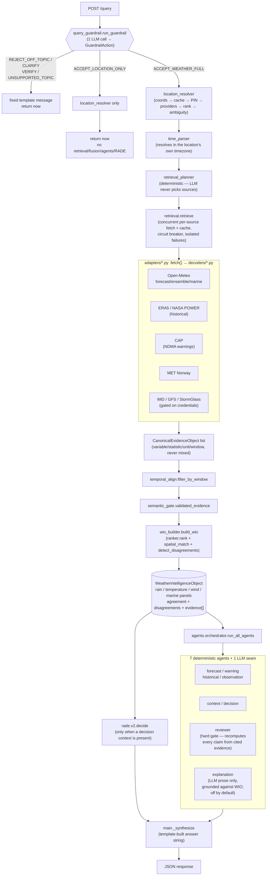

# Architecture

Request pipeline for `POST /query` / `POST /wio/query` (`app/main.py:_weather_request`).
Plain-language walkthrough of every box is in [SERVICES.md](SERVICES.md); this is the
shape of it. Numbers come from deterministic pipelines only — the one LLM box that can
influence dispatch (the guardrail) never originates a value, and the one LLM box that
writes prose (explanation) runs after fusion and is checked against it before it ships.

## Reading it

- **Guardrail is a decision, not a filter.** `GuardrailAction` is a real dispatch key —
  `ACCEPT_LOCATION_ONLY` skips retrieval/fusion/agents/RADE entirely (~1s instead of the
  full pipeline); everything left of "ACCEPT_WEATHER_FULL" returns a fixed template
  string, never LLM-composed prose.
- **The reviewer is the anti-hallucination gate.** Every numeric claim declares how it was
  derived (`sum`/`max`/`min`/`identity`/`none`); the reviewer re-runs that derivation over
  the evidence the claim actually cites and 503s the whole request on a mismatch — a claim
  citing real evidence can still fail review if the *value* attached to it is wrong.
- **Two sources are never averaged.** Fusion (`wio_builder.build_wio`) keeps every
  surviving CEO in `evidence[]`, presents the highest-ranked value per panel, and only
  ever *flags* disagreement — it never blends a government warning into a numeric mean.
- **The explanation LLM is inert by default** (`WEATHERGPT_LLM_ENABLED=false`), and even
  when on, writes prose *after* fusion, checked by the same reviewer gate — an ungrounded
  number in its output suppresses the explanation rather than reaching the client.
